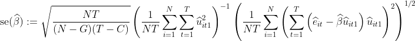

## pcluster

This is the first version of the R package 'pcluster'. 

To install and use the package, we recommend installing the package by
```{r }
install.packages("devtools")  # If not already installed
library(devtools)
install_github("Wei-M-Wei/pcluster")
```
Once installed, load the package with
```{r }
library(pcluster)
```

## Features
- **Main functionality**: Perform inference after discretizing unobserved heterogeneity in the panel data model, see the paper [^1].
- **Validation example**: An example 'test_example.R' is included. 'estimator_dc(formula, data, index)' is the main function.
- ```{r }
  help(estimator_dc) # check an example provided
  ```

## Additional resources
- **Replication code**: The repository includes replication code for all simulations and empirical applications.
- **Suggestions welcome**: Further improvements are planned, and we encourage feedback and suggestions to enhance the package.

## Corrected standard error
For inference, we use  heteroskedasticity autocorrelation consistent standard errors clustered at the level of each unit with a degree of freedom correction:

<p align="center">
  
</p>

## Example
```{r }
# data should contain the 'id', 'time', outcome variable Y and regressors X
data <- data.frame(id_code, time_code, vY, vX)

# Specify the regression formula, same as lm().
formula <- vY ~ vX - 1

# Specify the name of the 'id' and 'time' in your data
index = c("id_code", "time_code")

# Specify the initial iterations of kmeans cluster
init <- 300

# Baseline estimate, allows for cross-fitting
est <- estimator_dc(formula, data, index, init = init)

# We use the heteroskedasticity autocorrelation consistent standard errors clustered at the level of each unit,
# together with correction for the degrees of freedom
ols <- est[["res"]]
G <- est[["G"]]
C <- est[["C"]]
summary_correct = est$summary_table
coef_estimate = summary_correct$coefficients$Estimate
std_error = summary_correct$coefficients$`Std. Error corrected`

# We recommond having a look at the 'text_example.R', where the summary table of the model gives

> est$summary_table
$call
plm(formula = formula, data = new_data, model = "pooling", index = c("id", 
    "time"))

$coefficients
   Estimate Std. Error corrected t-value corrected Pr(>|t|) corrected Signif
vX 1.102312           0.04635639          23.77907       1.766731e-78    ***

$significance_codes
[1] "Signif. codes:  0 ‘***’ 0.001 ‘**’ 0.01 ‘*’ 0.05 ‘.’ 0.1 ‘ ’ 1"

in which we reported corrected standard error, t value, and p value in 'Coefficients'.

```
A CRAN release is coming soon.

## Reference
[^1]: Beyhum, J., Mugnier, M. Inference after discretizing unobserved heterogeneity. [[arXiv:2502.09740
Search](https://arxiv.org/abs/2502.09740).](https://arxiv.org/abs/2412.07352)
